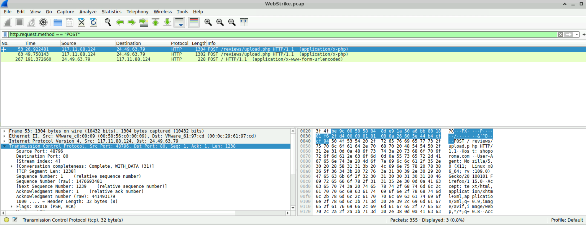
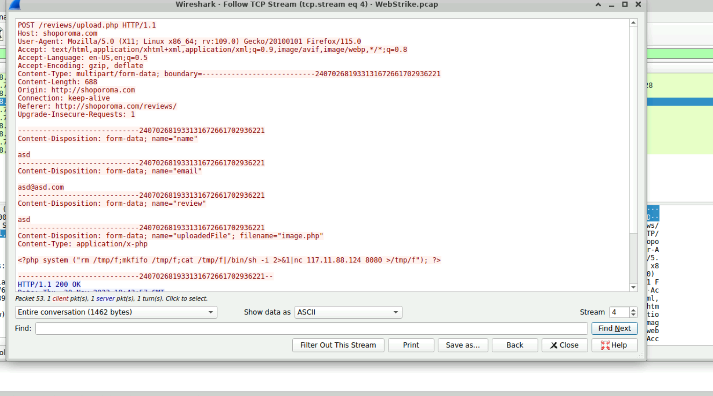
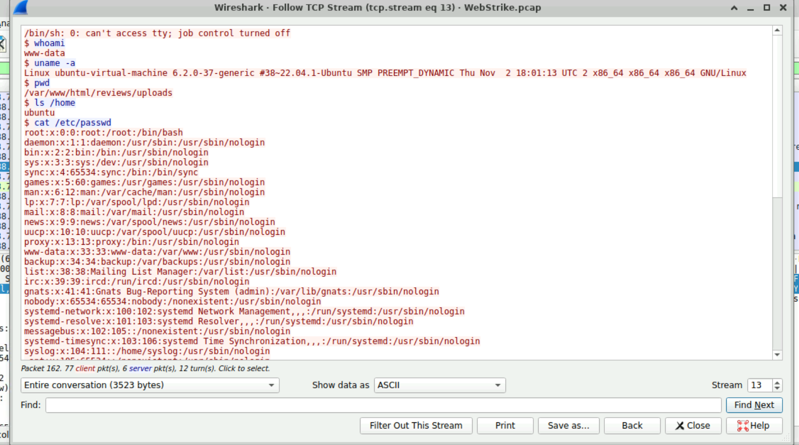

# SOC PCAP Web Attack Analysis

## 📌 Overview
This project documents a real-world cybersecurity investigation involving a compromised web server.  
The analysis was performed using a PCAP file to investigate how an attacker gained access, uploaded a malicious web shell, established a reverse shell connection, and accessed sensitive system data.

---

## 🎯 Objectives
- Identify the attacker source and origin  
- Detect malicious file upload activity  
- Analyze reverse shell communication  
- Investigate attacker behavior and command execution  
- Identify sensitive data access attempts  

---

## 🛠 Tools Used
- Wireshark  
- TCP Stream Analysis  
- HTTP Protocol Inspection  

---

## 🧠 Investigation Summary

### 1. Initial Access
The attacker interacted with the web application through multiple HTTP requests before exploitation.  
This behavior indicates reconnaissance and testing of the target web server.

---

### 2. Malicious File Upload
A suspicious HTTP POST request was identified targeting the file upload functionality:

POST /reviews/upload.php

The attacker uploaded a malicious PHP file:

image.php

The uploaded file contained a reverse shell payload designed to establish remote command execution on the compromised server.

---

### 3. Web Shell Execution
The uploaded web shell was executed successfully from the uploads directory:

/reviews/uploads/image.jpg.php

This allowed the attacker to gain remote shell access to the server.

---

### 4. Reverse Shell Activity
The attacker established a reverse shell connection and executed multiple reconnaissance commands, including:

whoami  
uname -a  
pwd  

The investigation identified:

- Compromised user:
www-data

- Working directory:
/var/www/html/reviews/uploads

The attacker also accessed sensitive system information, including:

/etc/passwd

---

## 🚨 Key Findings
- Vulnerable file upload functionality  
- Successful malicious PHP web shell upload  
- Reverse shell established to attacker-controlled host  
- Unauthorized remote command execution  
- Sensitive system file access observed  
- Full compromise of the web server  

---

## 🛡️ Recommendations
- Restrict executable file uploads  
- Validate file extensions and MIME types  
- Disable script execution inside upload directories  
- Monitor outbound network connections  
- Deploy a Web Application Firewall (WAF)  
- Continuously monitor suspicious HTTP POST activity  

---

## 🧾 Conclusion
This investigation demonstrates a complete web server compromise through insecure file upload functionality.

The attacker successfully:
1. Uploaded a malicious PHP web shell  
2. Executed the payload remotely  
3. Established a reverse shell connection  
4. Executed system reconnaissance commands  
5. Accessed sensitive system files  

This highlights the importance of secure file upload validation, network monitoring, and proactive threat detection.

---

## 📸 Screenshots

### 🔹 Malicious File Upload

### 🔹 Malicious Web Shell Payload

### 🔹 Reverse Shell Access

---

## 🔗 Author
Mohamed Elsayed